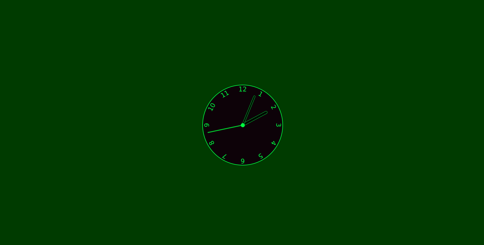

# Clock 

This is a simple clock using HTML/CSS/JS

## Screenshots:



## Built with:

HTML,
CSS,
JavaScript

## How to use:

```
Clone,
Open index.html
```

## Contribute:

Feel free to a fork the repo or notify me of any issues that are present

## Credit:

I made this project by following allong with - https://github.com/WebDevSimplified/JavaScript-Clock on YouTube - https://www.youtube.com/watch?v=Ki0XXrlKlHY

## License:

MIT © BChainDev